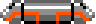

# 2025 OOPL Final Report

## 組別資訊

組別：L07\
組員：潘雙永\
復刻遊戲：Arkanoid

## 專案簡介

### 遊戲簡介
Arkanoid is an arcade game that was developed by Taito in 1986. It's a ball and paddle style game where the player takes control of a paddle 
at the bottom of the screen and uses it to try to destroy bricks by deflecting a ball into them and eventually clearing the screen to progress to 
the next level. The title ‘Arkanoid’ refers to a doomed mothership from which the player’s ship, the Vaus, escapes.
### 組別分工
潘雙永 – 100%
## 遊戲介紹
Arkanoid, the game I try to recreate in this course, is a ball and paddle style game. The name of the paddle is called “Vaus”. At the beginning of each level, the ball is stuck to “Vaus” and when the ‘Space’ key is pressed, the ball is released. The player has to destroy all the bricks(except golden bricks which are indestructible) in each level to move to the next level. When the ball touches the top border, its speed will maximize.
### 遊戲規則
Vaus

|    | Normal size Vaus   |
|---------------------------------------------------------|--------------------|
|         | Elongated Vaus     |
|  | Laser shooting Vaus|

Bricks
In the game, there are 10 kinds of bricks. Each brick has its own points when destroyed.
The golden bricks are indestructible.
To destroy silver bricks, the player must hit 2 times.

Indestructible

Must hit 2 times
Point = 50 * (level)

Point = 110

Point = 90

Point = 70

Point = 60

Point = 120

Point = 100

Point = 50

Point = 50

Pills
When a brick gets destroyed, one pill is spawned. Until “Vaus” has eaten the pill or the pill gets out of bound, there will be no more pill however the bricks get destroyed.
Each pill has its own unique power and the player gets points when “Vaus” eats the pill.

“E” Elongate Vaus
Point = 1000

“C” Catch the ball
Point = 1000

“P” Player – add live
Point = 1000

“D” Disruption – ball splits into 3
Point = 1000

“S” Slow down the ball’s speed
Point = 1000

“B” Break into new level
Point = 10000

“L” Laser shooting Vaus
Point = 1000

Point system
For every 10000 points, one extra live is added.

Levels
There are 33 levels in total. The final level is the boss level – the player has to kill the boss by hitting it 20 times with the ball.
Controls
Key “A”
Move left.

Key “D”
Move right.

Key “Space”
Release the ball.
In laser shooting state, it shoots lasers.

Key “P”
Pause the game.

Key “R”
Resume the game after pause.
Restart the game when the player loses the ball.
Restart the game when the player is out of lives.
Cheat Keys
Key “N”
Move to the next level.

Key “NUM_1”
One extra live is added.

### 遊戲畫面

## 程式設計

### 程式架構
### 程式技術

## 結語

### 問題與解決方法
### 自評

| 項次 | 項目                   | 完成 |
|------|------------------------|-------|
| 1    | 這是範例 |  V  |
| 2    | 完成專案權限改為 public |    |
| 3    | 具有 debug mode 的功能  |    |
| 4    | 解決專案上所有 Memory Leak 的問題  |    |
| 5    | 報告中沒有任何錯字，以及沒有任何一項遺漏  |    |
| 6    | 報告至少保持基本的美感，人類可讀  |    |

### 心得
### 貢獻比例
