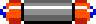

# 2025 OOPL Final Report

## 組別資訊

組別：P07\
組員：潘雙永\
復刻遊戲：Arkanoid

## 專案簡介

### 遊戲簡介
Arkanoid is an arcade game that was developed by Taito in 1986. It's a ball and paddle style game where the player takes control of a paddle 
at the bottom of the screen and uses it to try to destroy bricks by deflecting a ball into them and eventually clearing the screen to progress to 
the next level. The title ‘Arkanoid’ refers to a doomed mothership from which the player’s ship, the Vaus, escapes.
### 組別分工
潘雙永 – 100%
## 遊戲介紹
Arkanoid, the game I try to recreate in this course, is a ball and paddle style game. The name of the paddle is called “Vaus”. At the beginning of each level, the ball is stuck to “Vaus” and when the ‘Space’ key is pressed, the ball is released. The player has to destroy all the bricks(except golden bricks which are indestructible) in each level to move to the next level. When the ball touches the top border, its speed will maximize.
### 遊戲規則
#### Vaus
| Photo                                                   | Name               |
|---------------------------------------------------------|--------------------|
|    | Normal size Vaus   |
|         | Elongated Vaus     |
|  | Laser shooting Vaus|

#### Bricks
In the game, there are 10 kinds of bricks. Each brick has its own points when destroyed.
The golden bricks are indestructible.
To destroy silver bricks, the player must hit 2 times.

| Photo                                             | Description                                                        |
|---------------------------------------------------|--------------------------------------------------------------------|
|            | Indestructible                                                     |
|        | <ul><li>Must hit two times</li><li>Point = 50 * (level) </li></ul> | 
|            | <ul><li>Point = 110                                                |
|          | <ul><li>Point = 90                                                 |
|  | <ul><li>Point = 70                                                 |
|        | <ul><li>Point = 60                                                 |
|            | <ul><li>Point = 120                                                |
|              | <ul><li>Point = 100                                                |
|          | <ul><li>Point = 50                                                 |
|        | <ul><li>Point = 50                                                 |

#### Pills
When a brick gets destroyed, one pill is spawned. Until “Vaus” has eaten the pill or the pill gets out of bound, there will be no more pill however the bricks get destroyed.
Each pill has its own unique power and the player gets points when “Vaus” eats the pill.

| Photo                                                  | Description                                                               |
|--------------------------------------------------------|---------------------------------------------------------------------------|
|         | <ul><li>"E" Elongate Vaus</li><li>Point = 1000</li>                       |
|           | <ul><li>"C" Catch the ball</li><li>Point = 1000</li>                      |                                     
|           | <ul><li>"P" Player - add live</li><li>Point = 1000</li>                   |    
|  | <ul><li>"D" Disruption - ball splits into three</li><li>Point = 1000</li> |
|           | <ul><li>"S" Slow down the ball's speed</li><li>Point = 1000</li>          |                                            
|            | <ul><li>"B" Break into new level</li><li>Point = 10000</li>               | 
|             | <ul><li>"L" Laser shooting Vaus</li><li>Point = 1000</li>                 |     

#### Point system
For every 10000 points, one extra live is added.

#### Levels
There are 33 levels in total. The final level is the boss level – the player has to kill the boss by hitting it 20 times with the ball.
#### Controls
Key “A” -
Move left.

Key “D” -
Move right.

Key “Space” -
Release the ball.
In laser shooting state, it shoots lasers.

Key “P” - 
Pause the game.

Key “R” -
Resume the game after pause.
Restart the game when the player loses the ball.
Restart the game when the player is out of lives.
#### Cheat Keys
Key “N” -
Move to the next level.

Key “NUM_1” - 
One extra live is added.

### 遊戲畫面

- On the left side:
  - “Level” – showing the current level.
  - “Score” – showing the points of the player.

- Bottom left:
  - Show how many lives are left.

- On the right side:
  - Show the current state of the game – running/paused/game texts.

## 程式設計

### 程式架構
In game development, I used 11 classes.
- App
- BackgroundImage
- Ball
- Brick
- Character
- DOH
- Entity
- GameText
- Laser
- LevelManager
- Pill
#### The relationship between classes(class hierarchy)

### 程式技術
#### Handling collision between the ball and the bricks
The function calculates the overlap between the ball and the brick along both the x-axis and y-axis by comparing their positions and scaled sizes. This overlap helps determine which side of the brick the ball collided with.
If the vertical overlap (overlapY) is smaller than the horizontal overlap (overlapX), it implies a top or bottom collision. The ball’s y-position is adjusted, and its y-velocity is reflected. Otherwise, it’s a side collision, and the x-position and x-velocity are updated accordingly.
The direction change of the ball is handled by the ReflectVector function, which calculates the reflection of the ball’s velocity vector based on the normal of the collision surface.
#### Law of reflection equation

#### Brick Collision Prioritization
To improve collision response in levels where the ball might intersect multiple bricks simultaneously (e.g., corner or fast collisions), the function LevelManager::PrimaryCollidedBrick determines the primary brick to interact with. This avoids unnatural reactions from responding to multiple bricks at once.

## 結語
After creating this game, I got more familiar with C++ and the concepts of OOP. The most important logics that I learned include collision detections, handling the collisions, and updating positions and movements every frame.
### 問題與解決方法
The most difficult part of this game was handling the ball movement.
It was hard to solve the trajectory direction of the ball after hitting the brick.
I searched for a solution on the internet and found a video that helped me.
I used the law of reflection to reflect the ball when it hits a brick. And I found out that the vector section from linear algebra is important for game development.

### 自評

| 項次 | 項目                     | 完成 |
|------|------------------------|----|
| 1    | 這是範例                 | V  |
| 2    | 完成專案權限改為 public        | V  |
| 3    | 具有 debug mode 的功能      | V  |
| 4    | 解決專案上所有 Memory Leak 的問題 | V  |
| 5    | 報告中沒有任何錯字，以及沒有任何一項遺漏   | V  |
| 6    | 報告至少保持基本的美感，人類可讀       | V  |

### 心得
After this course, I’ve learned a lot about C++ and OOP. At first, I thought developing a game was really difficult. I thought I could not create a game. But after this course, I think that creating a game is something I can do. But it takes a lot of time. Overall, this course gives me interest about game development and confidence to create one. At last, I have a project to show off on my github. When I get free time, maybe I will create another game using a game engine.
### 貢獻比例
潘雙永 – 100%
